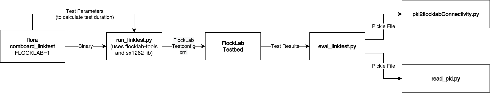

# Linktest

Link test for running on FlockLab 2. Two modes are supported:
* point-to-point (measures packet reception ratio (PRR), RSSI, and CRC errors)
* flooding

## How to Use
### Initial Checkout and Compile of the Project
* See [instructions](https://gitlab.ethz.ch/tec/public/flora/wiki#clone-compile-run) for flora apps

### Running a Test
1. Set the configuration parameters in `app_config.h`:
    * Choose the mode for the link test, i.e. set exactly one of the two defines to 1:  
    `TESTCONFIG_P2P_MODE`, `TESTCONFIG_FLOOD_MODE`
    * For point-to-point link tests: set all `TESTCONFIG_xxx` and `RADIOCONFIG_xxx` defines
    * For flooding link tests: set all `TESTCONFIG_xxx` and `FLOODCONFIG_xxx` defines
2. Build the project using the IDE
3. Run `./Scripts/run_linktest.py`  
   (requires the [`flocklab-tools`](https://pypi.org/project/flocklab-tools/) and `GitPython` python packages)

### Evaluation of a Test
1. Run eval script: `./Scripts/eval_linktest.py [testno]`  
   (Results are then available as generated `.html` and `.pkl` files in `./data/`.)

## Code Overview

## Timing

